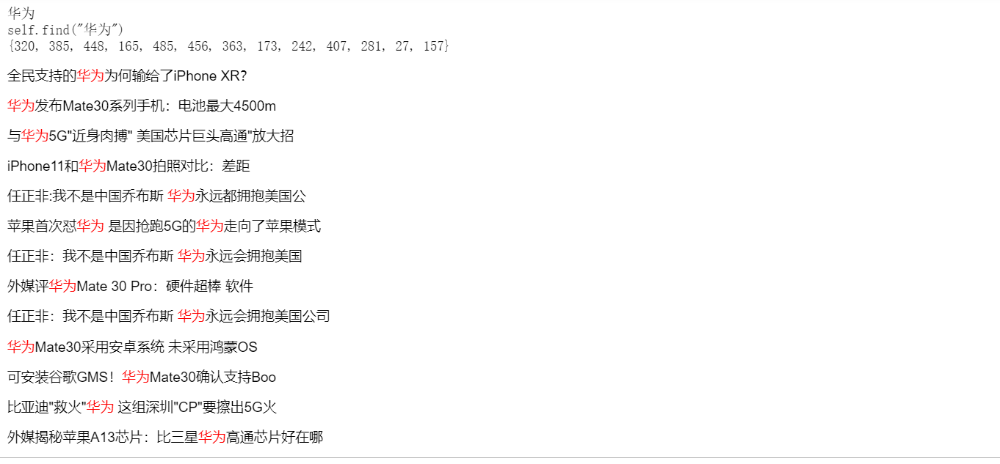
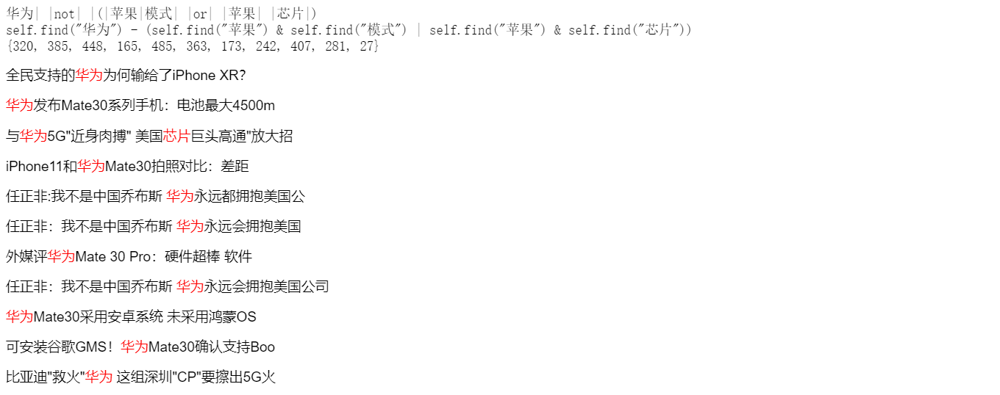

# class_5-GinkgoX
class_5-GinkgoX created by GitHub Classroom
homework description:
#### homework description：

1. to complete the word_match and conv_query function, it satisfies:

   1. ```python
      keywords = '苹果模式 and (三星 or 华为)'
      ```

   2. ```python
      keywords = '苹果   模式 and (三星 or 华为)'
      ```

   3. ```python
      keywords = '华为 - (苹果模式 or 苹果 芯片)'
      ```

2. to package InvertSearch as a class, achieve insert, find, search .etc function

#### solution:

to convert keywords as ***'standard'*** search mode, then use the search method as before mentioned

- convert '苹果模式' to '苹果  & 模式'， then find('苹果') & find（'模式')
- convert ''苹果     模式'' to '苹果 模式' with *split()* function
- convert ' - ' as ' not' function as set object operation

#### result:

```python
keywords = '华为'
```



```python
keywords = '华为 - (苹果模式 or 苹果 芯片)'
```


