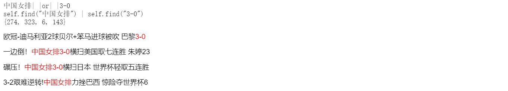

# class_6-GinkgoX
class_6-GinkgoX created by GitHub Classroom
#### homework description：

1. use jieba.cut_for_search to construct new searcher
2. complete the find and convert method as the same function as parse_add
3. optimize the code: use function to package the same code 

#### solution:

1. replace the original jieba.cut() with parse_add();
2. to save the space, when searching, set **parse_doc(self, doc, cutflage=0)**;
3. create a **extender(self, state, cache, cutflag)** function to create/search database flexiblely

#### result:

```python
keywords = '中国女排 or 3-0 '
```


