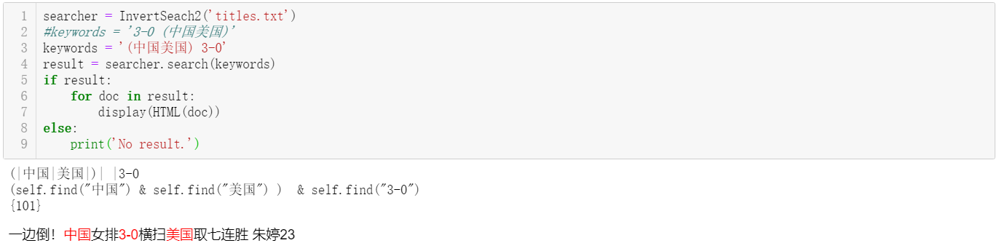
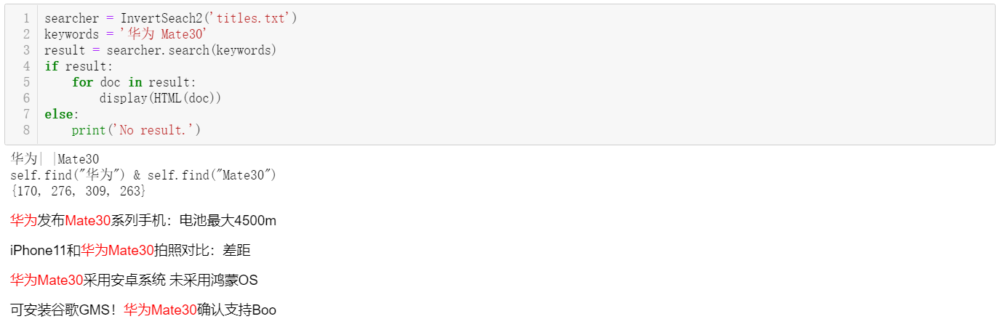
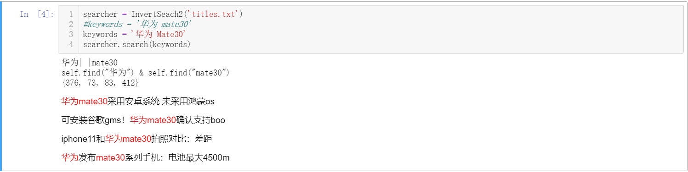

# class_7-GinkgoX

class_7-GinkgoX created by GitHub Classroom

#### homework description：

bug case:

1. ```python
   keywords = '中国美国'
   ```

2. ```python
   keywords = '(中国美国) 3-0' #keywords = ' 3-0 (中国美国)'
   ```

3. ```python
   keywords = '华为 mate30' #keywords = '华为 Mate30'
   ```

#### solution:

1. For bug case 1, as I do in class_6, split keywords as 'doc', then generate 'items', search as jieba.cut() flag as **parse_doc() function**

2. For bug case 2, the main process contains in **( )**, the ’(‘ with space before and ')' with space after.

    if form as "XX _ (" (XX means word, _ means space), identify doc[id] and doc[id+2];

    if form as ") _ XX"(XX means word, _ means space), identify doc[id] == ')' and doc[id+2] is word

3. For bug case 3, the simple way is use **parse_doc()** to split keywords, then highlighter the keyword in 

#### result:

```python
keywords = '(中国美国) 3-0' #keywords = ' 3-0 (中国美国)'
```



```python
keywords = '华为 Mate30'
```



```python
keywords = '华为 mate30'
```

